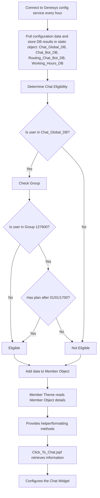

## Process Overview

The process involves connecting to the Genesys configuration service every hour to retrieve configuration data. This data is then stored in a static object, which includes results from various databases.

## Databases

- **Chat_Global_DB**: A map of strings.
- **Chat_Bot_DB**: A list of strings.
- **Routing_Chat_Bot_DB**: A list of strings.
- **Working_Hours_DB**: A map of strings.

## Chat Eligibility

To determine chat eligibility:
- A user is considered eligible if they are present in the Chat_Global_DB.
- There is an override for user 127600 if they have a plan after a specific date.

## Member Object

The relevant data is added to a Member Object, which is then read by Member Theme (Member Utils) to provide helper and formatting methods.

## Chat Widget Configuration

Finally, Click_To_Chat.jspf retrieves information from Member Theme to configure the Chat Widget.

