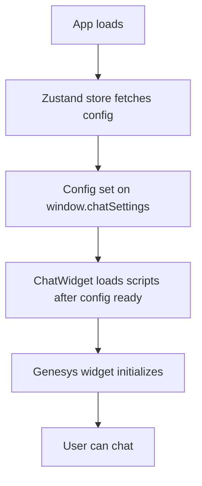

# Genesys Chat System – Simplified Implementation Documentation

This is the up-to-date reference for the Genesys chat integration in the Member Portal. It covers the new architecture, file structure, integration flow (legacy vs. cloud), and best practices.

---

## 1. Modern Architecture Overview

- **Single Source of Truth:** All chat config and state is managed in a Zustand store (`chatStore.ts`).
- **Config Assembly:** The config is built from environment variables, API responses, and user/plan context, then exposed as `genesysChatConfig` in the store and on `window.chatSettings`.
- **Minimal Loader:** The `ChatWidget` component loads Genesys scripts only after config is ready, sets all required globals, and handles both cloud and legacy modes.
- **No Legacy Fallbacks:** All legacy/duplicate config logic, props, and multi-fallback systems have been removed for clarity and maintainability.

---

## 2. Key Files

| File Name                | Location                 | Responsibility                                 |
| ------------------------ | ------------------------ | ---------------------------------------------- |
| **ChatWidget.tsx**       | src/app/chat/components/ | Loads scripts, sets globals, renders chat root |
| **chatStore.ts**         | src/app/chat/stores/     | Zustand store: config, state, actions          |
| **genesysChatConfig.ts** | src/app/chat/            | Config builder, DTO, and type safety           |
| **endpoints.ts**         | src/app/chat/config/     | Centralizes endpoint construction from .env    |
| **click_to_chat.js**     | public/assets/genesys/   | Genesys widget logic (legacy/cloud)            |

---

## 3. Integration Flow (Simplified)

1. **Config & State**

   - On app load, the Zustand store fetches user/plan context, chat token, and chat info from APIs.
   - The config is built from these sources and environment variables, then stored as `genesysChatConfig`.
   - The config is also set on `window.chatSettings` for Genesys scripts.

2. **Widget Loading**

   - `ChatWidget` only renders and loads scripts after `genesysChatConfig` is ready.
   - All required globals (`window.chatSettings`, `window.gmsServicesConfig`) are set before any Genesys scripts are loaded.
   - CSS is loaded first, then `click_to_chat.js`, then (for legacy) `widgets.min.js`.
   - The widget automatically handles both cloud and legacy modes based on config.

3. **No Redundant Fallbacks**
   - All multi-fallback button creation and legacy config merging logic has been removed.
   - The widget is robust and race-free by design: scripts only load after config is ready.

---

## 4. Environment Variables

All sensitive and environment-specific values (base URLs, bot IDs, org IDs, etc.) are set in `.env` files and referenced in `endpoints.ts` for endpoint construction.

---

## 5. Example: How It Works

```tsx
// In ChatWidget.tsx
const { genesysChatConfig, isLoading, error } = useChatStore();
useEffect(() => {
  if (!genesysChatConfig) return;
  window.chatSettings = genesysChatConfig;
  window.gmsServicesConfig = { GMSChatURL: () => genesysChatConfig.gmsChatUrl };
  // Load CSS, then scripts...
}, [genesysChatConfig]);
```

---

## 6. Troubleshooting

- **Button not appearing:** Check for script errors, ensure config is ready before widget loads.
- **Wrong mode:** Ensure `chatMode` and all required fields are set in config.
- **Environment mismatch:** Check that all endpoints and IDs are set from the correct `.env` for your environment.

---

## 7. Updating Genesys Integration

- Update `.env` for new endpoints or IDs.
- Update `endpoints.ts` if endpoint construction logic changes.
- Update `genesysChatConfig.ts` for new config fields.
- Test both cloud and legacy modes after any update.

---

## 8. Summary Diagram



---

**This new flow is robust, maintainable, and fully aligned with Genesys best practices.**
