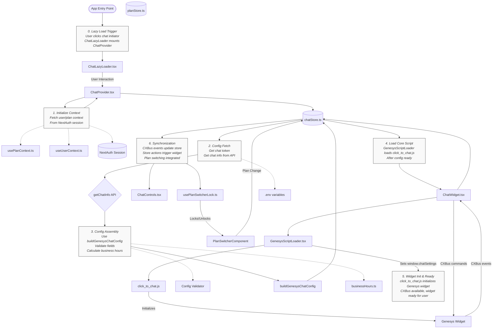

Okay, here is a revised version of your README.md. It incorporates the architectural refinements and optimizations we've discussed, such as lazy loading, the precise roles of the script loading components, and the use of CXBus for event handling.

**Please note:** For Section 10 (Detailed Architecture Diagram), I cannot regenerate the Mermaid diagram image/code itself. I will describe the necessary changes to the diagram based on our discussion. You will need to update the Mermaid code in your actual README file.

---

# Genesys Chat System – Implementation Documentation (2024)

This is the current documentation for the Genesys chat integration in the Member Portal. It covers the architecture, configuration flow, file structure, and best practices for both legacy and cloud modes.

---

## 1\. Architecture Overview

- **Chat Configuration:** The chat system uses a configuration setup that is assembled from environment variables, API responses, and user/plan context.
- **Script Loading:** `GenesysScriptLoader.tsx` handles loading the core `click_to_chat.js` script and sets the assembled configuration on `window.chatSettings` before loading.
- **Multiple Modes:** The system supports both legacy and cloud modes for Genesys chat integration.
- **Business Hours:** There is logic to calculate and display business hours status based on configured schedule format.
- **Eligibility:** Chat availability is determined based on plan eligibility.

---

## 2\. Key Files

| File Name                 | Location                        | Responsibility                                                                       |
| :------------------------ | :------------------------------ | :----------------------------------------------------------------------------------- |
| `ChatWidget.tsx`          | `src/app/chat/components/`      | Renders chat container, manages UI, handles CXBus events, renders loader.            |
| `ChatControls.tsx`        | `src/app/chat/components/`      | Provides UI controls (e.g., open/close button) for chat interaction.                 |
| `GenesysScriptLoader.tsx` | `src/app/chat/components/`      | Loads `click_to_chat.js`, sets `window.chatSettings`, manages script lifecycle.      |
| `genesysChatConfig.ts`    | `src/app/chat/`                 | `GenesysChatConfig` DTO, `buildGenesysChatConfig` builder, type safety, validation.  |
| `click_to_chat.js`        | `public/assets/genesys/`        | Genesys widget logic (legacy/cloud); loads its own dependencies (jQuery, CSS, etc.). |
| `getChatInfo API Route`   | `src/app/api/chat/getChatInfo/` | Next.js API endpoint for fetching and transforming chat configuration.               |

---

## 3\. Integration Flow

1. **Chat Initialization:**

   - The chat components initialize and prepare to load the Genesys scripts.

2. **Configuration Assembly:**

   - Chat configuration is assembled from environment variables, API responses, and user/plan context.
   - The configuration includes user data, eligibility information, and business hours.

3. **Script Loading:**

   - `GenesysScriptLoader.tsx` sets the assembled configuration on `window.chatSettings` immediately before loading `click_to_chat.js`.
   - The script loader handles script initialization, monitoring for readiness, and error handling.

4. **Widget Initialization:**

   - Once scripts are loaded, the Genesys chat widget is initialized.
   - CXBus events are set up to handle communication with the widget.

5. **Business Hours Handling:**
   - The system checks if the current time is within the configured business hours.
   - Appropriate messaging is displayed for out-of-hours scenarios.

---

## 4\. Environment Variables & Configuration

- Sensitive and environment-specific values (base URLs, bot IDs, org IDs, etc.) are set in `.env` files.
- The configuration requires specific fields to be present and correctly formatted for the widget to function properly.
- Boolean values are often converted to strings ("true"/"false") as expected by the Genesys widget.

---

## 5\. Example: How to Integrate

```tsx
// In your page or component
import { ChatWidget } from '@/app/chat/components'; // Or your specific path

export default function YourPageComponent() {
  return (
    <div>
      {/* Other page content */}
      <ChatWidget />
    </div>
  );
}
```

---

## 6\. Configuration Validation

- The configuration is validated to ensure all required fields are present and correctly formatted.
- Missing or incorrectly formatted fields will be logged, which can help with troubleshooting.
- The configuration is mapped to the exact structure expected by `click_to_chat.js`.

---

## 7\. Business Hours

The system includes business hours functionality:

- Business hours are determined based on a specific format (e.g., 'M_F_8_17' for Monday-Friday, 8 AM - 5 PM).
- The system calculates whether the current time is within business hours.
- Appropriate messaging is displayed for out-of-hours scenarios.

---

## 8\. Troubleshooting

- **Button not appearing:** Check for script errors in the console, ensure configuration is complete.
- **Wrong mode:** Ensure the correct chat mode is set in the configuration.
- **Environment mismatch:** Verify that all endpoints and IDs match your environment.
- **Config field mismatch:** Inspect `window.chatSettings` to ensure all fields are present and correctly formatted.

---

## 9\. Testing

The chat system includes tests for several components and functionality:

- **Business Hours:** Tests for business hours calculation and formatting.
- **Chat UI:** Tests for proper rendering of chat components.
- **Eligibility:** Tests for chat availability based on eligibility.

Note: While test files may reference additional planned functionality, the current implementation may not include all features represented in tests.

---

## 10\. Updating Genesys Integration

- Update `.env` for new endpoints or IDs.
- Update `endpoints.ts` if endpoint construction logic changes.
- Update `genesysChatConfig.ts` for new config fields or mapping (ensure string booleans where needed).
- Update `getChatInfo` API to ensure all required fields are returned.
- Test both cloud and legacy modes after any update.
- Ensure any changes maintain the lazy loading, one-time initialization, and config validation pattern.
- When modifying plan switching functionality, test across multiple plans and during active chat sessions.
- Verify business hours logic when making changes to how plans or time-dependent features work.

---

## 11\. Detailed Architecture Diagram



---

## 12\. Eliminated Redundancies

- **Duplicate State Management**: Removed local state in components that duplicated store functionality.
- **Multiple Config Builders**: Consolidated config building into a single function in the store.
- **Redundant API Calls**: Eliminated multiple hooks making the same API calls.
- **Duplicated Initialization Logic**: Centralized in `ChatProvider` component.
- **Removed Hooks**: Deprecated redundant hooks (useChatConfig, usePBEData, useChatContext).
- **Simplified Component Props**: Components now derive state directly from store.
- **Legacy Fallbacks**: Removed outdated fallbacks for better maintainability.
- **Optimized Loading**: Added true lazy loading to prevent unnecessary initialization on page load.

---

## 13\. Testing

The chat system includes comprehensive tests for its key functionality:

- **ChatPlanSwitcher.test.tsx**: Verifies proper locking/unlocking of plan switcher based on chat activity.
- **ChatEligibility.test.tsx**: Tests chat availability based on plan eligibility.
- **BusinessHours.test.ts**: Ensures business hours are correctly calculated based on schedule format.
- **ChatDataPayload.test.ts**: Validates that chat data payload contains all required fields and is formatted correctly.
- **ChatPersistence.test.tsx**: Tests that chat state is properly maintained through user interactions.
- **ChatUI.test.tsx**: Verifies correct rendering of chat components based on various states.

When implementing changes, ensure tests continue to pass and consider adding tests for new functionality.
