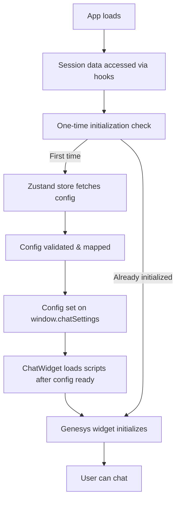

# Genesys Chat System – Implementation Documentation (2024 Update)

This is the up-to-date reference for the Genesys chat integration in the Member Portal. It covers the architecture, config flow, file structure, validation, and best practices for both legacy and cloud modes.

---

## 1. Modern Architecture Overview

- **Single Source of Truth:** All chat config and state is managed in a Zustand store (`chatStore.ts`).
- **Config Assembly:** The config is built from environment variables, API responses (`getChatInfo`), and user/plan context, then exposed as `genesysChatConfig` in the store and on `window.chatSettings`.
- **Config Validation:** Before any Genesys scripts load, the config is validated for all required fields (see `genesysChatConfig.ts`). Any missing or mismatched fields are logged in dev.
- **Minimal Loader:** The `ChatWidget` component loads Genesys scripts only after config is ready and validated, sets all required globals, and handles both cloud and legacy modes.
- **No Legacy Fallbacks:** All legacy/duplicate config logic, props, and multi-fallback systems have been removed for clarity and maintainability.
- **Optimized Initialization:** One-time initialization with refs prevents infinite API request loops and ensures resources are loaded efficiently.
- **Cobrowse & Optional Features:** Cobrowse and other features are toggled via config fields and can be disabled for troubleshooting or by environment.

---

## 2. Key Files

| File Name                | Location                      | Responsibility                                 |
| ------------------------ | ----------------------------- | ---------------------------------------------- |
| **ChatWidget.tsx**       | src/app/chat/components/      | Loads scripts, sets globals, renders chat root |
| **chatStore.ts**         | src/app/chat/stores/          | Zustand store: config, state, actions          |
| **genesysChatConfig.ts** | src/app/chat/                 | Config builder, DTO, type safety, validation   |
| **endpoints.ts**         | src/app/chat/config/          | Centralizes endpoint construction from .env    |
| **click_to_chat.js**     | public/assets/genesys/        | Genesys widget logic (legacy/cloud)            |
| **useUserContext.ts**    | src/app/chat/hooks/           | Session-based user context hook                |
| **usePlanContext.ts**    | src/app/chat/hooks/           | Session-based plan context hook                |
| **getChatInfo**          | src/app/api/chat/getChatInfo/ | API endpoint for chat config                   |

---

## 3. Integration Flow (2024)

1. **Session Access & Context**

   - `useUserContext` and `usePlanContext` hooks extract user and plan data from NextAuth session.
   - Context follows the session structure: `session.user.currUsr.plan.memCk` for member ID and `session.user.currUsr.plan.grpId` for plan ID.

2. **Config Fetch & Assembly**

   - The Zustand store fetches user/plan context, chat token, and chat info from APIs (notably `getChatInfo`).
   - The config is built from these sources and environment variables using `buildGenesysChatConfig` in `genesysChatConfig.ts`.
   - All required fields (see `GenesysChatConfig` interface) are validated for presence and type. Missing or mismatched fields are logged in dev.
   - The config is mapped to the exact structure expected by `click_to_chat.js` and set on `window.chatSettings`.

3. **Widget Loading**

   - `ChatWidget` only renders and loads scripts after `genesysChatConfig` is ready and validated.
   - All required globals (`window.chatSettings`, `window.gmsServicesConfig`) are set before any Genesys scripts are loaded.
   - CSS is loaded first, then `click_to_chat.js`, then (for legacy) `widgets.min.js`.
   - The widget automatically handles both cloud and legacy modes based on config.

4. **No Redundant Fallbacks**

   - All multi-fallback button creation and legacy config merging logic has been removed.
   - The widget is robust and race-free by design: scripts only load after config is ready and validated.

5. **Cobrowse & Optional Features**
   - Cobrowse and other features are toggled via config fields (e.g., `isCobrowseActive`).
   - These can be disabled for troubleshooting or by environment.

---

## 4. Environment Variables & API Parity

- All sensitive and environment-specific values (base URLs, bot IDs, org IDs, etc.) are set in `.env` files and referenced in `endpoints.ts` for endpoint construction.
- The API (`getChatInfo`) must return all required fields as defined in `GenesysChatConfig`.
- The config builder (`genesysChatConfig.ts`) ensures that all fields are present and mapped to the names/structure expected by `click_to_chat.js`.
- **Parity is critical:** If any required field is missing or mismatched, the widget may fail to load or behave unexpectedly.

---

## 5. Example: How It Works

```tsx
// In ChatWidget.tsx
const { genesysChatConfig, isLoading, error } = useChatStore();
const userContext = useUserContext();
const { planContext } = usePlanContext();
const didInitialize = useRef(false);

// Memoized initialization function
const initializeChat = useCallback(() => {
  if (userContext?.memberId && planContext?.planId) {
    loadChatConfiguration(userContext.memberId, planContext.planId);
  }
}, [userContext?.memberId, planContext?.planId, loadChatConfiguration]);

// One-time initialization effect
useEffect(() => {
  if (didInitialize.current || !userContext?.memberId || !planContext?.planId)
    return;
  didInitialize.current = true;
  initializeChat();
}, [userContext, planContext, initializeChat]);

// Script loading effect
useEffect(() => {
  if (!genesysChatConfig) return;
  window.chatSettings = genesysChatConfig;
  window.gmsServicesConfig = { GMSChatURL: () => genesysChatConfig.gmsChatUrl };
  // Load CSS, then scripts...
}, [genesysChatConfig]);
```

---

## 6. Config Validation & Mapping

- The config builder (`buildGenesysChatConfig`) validates all required fields for presence and type.
- If any required field is missing, a detailed error is logged in dev.
- The config is mapped to the exact structure expected by `click_to_chat.js` (see both the interface and the script for field names).
- Optional features (like cobrowse) are toggled via config fields and can be omitted or set to false/empty as needed.
- **Best Practice:** Always inspect `window.chatSettings` in the browser before loading Genesys scripts to confirm all required fields are present and correct.

---

## 7. Troubleshooting

- **Button not appearing:** Check for script errors, ensure config is ready and validated before widget loads.
- **Wrong mode:** Ensure `chatMode` and all required fields are set in config.
- **Environment mismatch:** Check that all endpoints and IDs are set from the correct `.env` for your environment.
- **Infinite API calls:** Check if initialization logic is being triggered multiple times - ensure `didInitialize` ref is working properly.
- **Session data missing:** Verify session structure and ensure `useUserContext` and `usePlanContext` are correctly accessing session data.
- **Config field mismatch:** If the widget fails to load or behaves unexpectedly, inspect `window.chatSettings` and compare to `GenesysChatConfig` and `click_to_chat.js` for missing or mismatched fields.

---

## 8. Updating Genesys Integration

- Update `.env` for new endpoints or IDs.
- Update `endpoints.ts` if endpoint construction logic changes.
- Update `genesysChatConfig.ts` for new config fields or mapping.
- Update `getChatInfo` API to ensure all required fields are returned.
- Test both cloud and legacy modes after any update.
- Ensure any changes maintain the one-time initialization and config validation pattern.

---

## 9. Summary Diagram



---

**This flow is robust, maintainable, fully aligned with Genesys best practices, and optimized for performance.**
